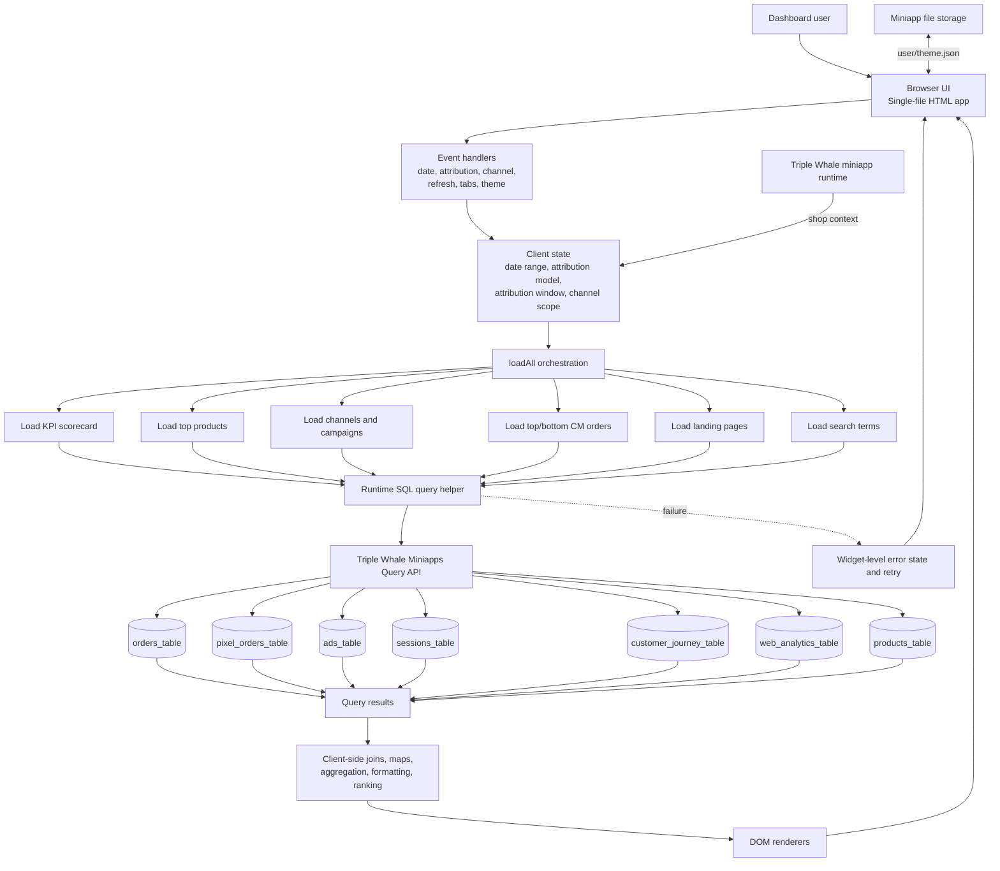

# Under the Hood: Architecting a Real-Time Triple Whale & Moby AI Dashboard (Backend to Frontend)

In the fast-paced world of ecommerce apparel, having access to real-time, actionable data is critical. For a fast-growing **Ecommerce Clothing Brand**, we needed a highly responsive, customized dashboard that could synthesize complex attribution, channel performance, and product data. 

Embracing the concept of **vibe coding**—focusing rapidly on outcomes and architecture with AI assistance—we built a custom **Moby AI app** integrated directly into the **Triple Whale** ecosystem. To truly understand how this blazing-fast, single-page application works, we need to trace the data journey from the ground up: starting at the backend data tables and moving all the way up to the glass of the frontend UI.

---

## 1. The Backend: Data Sources & Truth

The foundation of any analytics dashboard is its data. In the Triple Whale ecosystem, our Moby AI app pulls live, read-only data from several core warehouse tables at runtime. There is no intermediate database caching our business logic; we go straight to the source.

* **`orders_table`**: The ultimate source of transaction truth. This table provides revenue, taxes, quantities, discounts, Cost of Goods Sold (COGS), shipping costs, fees, and the vital contribution margin used for order-level ranking.
* **`pixel_orders_table`**: The core of our attribution logic. It links orders to channels and campaigns based on the selected attribution model and window.
* **`ads_table`**: Feeds us spend and one-day link-click metrics broken down by channel and campaign.
* **`sessions_table` & `customer_journey_table`**: Provide deep insights into user behavior, landing pages, onsite search events, and product-page views.
* **`products_table`**: Delivers the product catalog details, images, variant data, and live inventory.
* **`web_analytics_table`**: Supplies sitewide bounce-rate metrics.

---

## 2. Data Access: The Query API

To bridge the gap between these robust backend tables and the client, we rely on the **Triple Whale Miniapps Query API**. 

The app defines SQL templates directly within the code. Through the runtime SQL query helper, we execute highly parameterized queries based on user selections. Parameters dynamically injected include:
* `startDate` and `endDate` (calculated in the shop's local timezone).
* `attribution_window`.
* Curated arrays of Campaign, Product, Order, Landing Page, or Channel IDs.

*Security Note:* All SQL is strictly read-only. Furthermore, the attribution model is selected from a hardcoded allow-list, ensuring no user-entered free text ever makes it into a SQL literal.

---

## 3. The Architecture Flow

Before the data hits the UI, it passes through an orchestration and transformation layer. Here is the visual architecture mapping how user state triggers queries, which in turn pull from the backend to render the frontend.

---

## 4. The Middleware: Client-Side Transformation

In traditional architectures, a Node.js or Python backend would process the SQL results before sending JSON to the frontend. In our **single-page, single-file HTML app**, the browser handles the heavy lifting.

Once the `loadAll()` orchestrator receives the result arrays from the Query API, the browser-side JavaScript performs bounded transformations:
* **Joining:** Merging attribution rows to order-level contribution margins by order ID.
* **Mapping:** Aligning campaign/channel spend, clicks, views, and product data.
* **Combining:** Linking abstract product data with live catalog images and inventory.
* **Computing:** Calculating complex display metrics on the fly, including Average Order Value (AOV), Conversion Rate (CVR), Contribution Margin (CM) per order, Customer Acquisition Cost (CAC), and bounce rates.
* **Formatting:** Formatting currency, percentages, and dates before passing them to the DOM renderers.

---

## 5. The Frontend: Presentation & UI

The frontend is an exercise in speed and simplicity. It is implemented purely using vanilla JavaScript, embedded CSS, and **Tailwind CSS** loaded via CDN. There is no React, Vue, or Angular overhead.

### State Management & Controls
The client state acts as the brain of the UI. It tracks the date preset, attribution model/window, and the channel scope (including an intelligent "Paid Channels Only" mode). Changing a date, attribution setting, or channel scope instantly invalidates affected cached data and reloads specific widgets independently.

### The Dashboard Widgets
The UI renders six distinct data widgets:
1. **KPI Scorecard:** Loads order KPIs, bounce rate, unique views, and platform clicks. It dynamically switches between attributed order populations and sitewide metrics based on channel filters.
2. **Top Selling Products:** Renders ranked product cards by combining attributed sales, product-page views, catalog metadata, inventory, and images.
3. **Top Channels & Campaigns:** Displays attributed orders, ad spend, one-day platform clicks, and top products. A unified loading pipeline powers snappy tabs between Channels and Campaigns.
4. **Orders:** Highlights the Top 10 and Bottom 20 orders by contribution margin, factoring in blended spend-per-order to calculate true CAC.
5. **Landing Pages:** Groups session-level data by base URL (stripping query parameters) to highlight bounce rates, CVR, and AOV for top entry points.
6. **Search Terms:** Matches onsite search events to subsequent attributed orders, capturing the value of searches even across later sessions.

### Resiliency & UX
Because we fetch data directly from warehouse tables at runtime, widget-level failure handling is crucial. Using `Promise.allSettled()`, individual query results are evaluated independently. Loading skeletons preserve layout structure before data arrives, and if a query fails, localized retry buttons allow the user to reload just that specific widget group without refreshing the entire page.

## Conclusion

By rethinking standard application boundaries, we created a deployment model where HTML, CSS, SQL templates, data loading, transformation logic, and rendering behavior all live in a single source file. 

This vibe-coded approach—layered on top of the Triple Whale and Moby AI platforms—proves that with a direct pipeline from backend tables to frontend transformations, you can deliver an incredibly capable, lightning-fast ecommerce dashboard.
